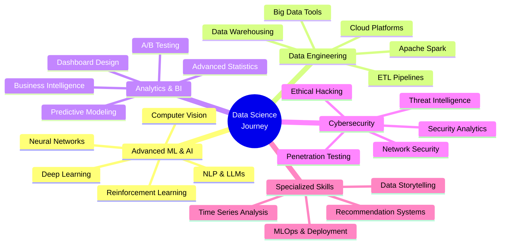
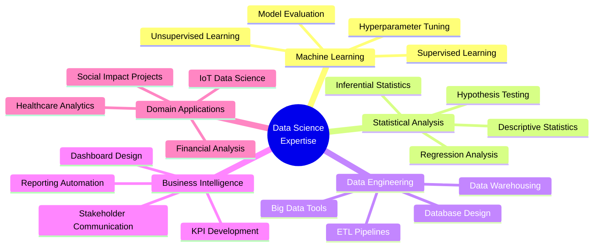

<div align="center">

<!-- Animated Header -->


<!-- Animated Typing SVG -->
<a href="https://git.io/typing-svg"></a>

<!-- Social Badges with Glow Effect -->
<p align="center">
  <a href="mailto:priyanshu.edu.py@gmail.com">
    
  </a>
  <a href="https://linkedin.com/in/priyanshuarc">
    
  </a>
  <a href="https://t.me/priyanshuarc">
    
  </a>
  <a href="https://github.com/priyanshuarc">
    
  </a>
  <a href="tel:+917021884961">
    
  </a>
</p>

<!-- Animated Profile Views Counter -->


</div>

---

<!-- Wave Animation -->


## 🎯  About Me

```python
class DataScientist:
    def __init__(self):
        self.name = "Priyanshu Pandey"
        self.role = "Data Scientist & AI Engineer"
        self.education = "B.Sc. IT @ Thakur College, Mumbai"
        self.year = "2nd Year (2024-2027)"
        self.location = "🌍 Mumbai, India"
        self.languages = ["English", "Hindi"]
        
    def skills(self):
        return {
            "data_science": ["Machine Learning", "Deep Learning", "Statistical Analysis"],
            "analytics": ["SQL", "Excel", "Power BI", "Tableau"],
            "programming": ["Python", "C++", "Java", "JavaScript"],
            "ai_ml": ["TensorFlow", "PyTorch", "Scikit-learn", "NLP"],
            "cybersecurity": ["Network Security", "Ethical Hacking", "Pentesting"],
            "tools": ["Git", "Docker", "Linux", "Firebase", "Arduino"],
            "design": ["Figma", "Blender", "Photoshop", "UI/UX"]
        }
    
    def current_goals(self):
        return [
            "🎯 Targeting Google Data Analytics Apprenticeship 2026",
            "📊 Mastering Advanced ML & AI Algorithms",
            "🔐 Expanding Cybersecurity Knowledge",
            "🚀 Building AI-Powered Data Solutions"
        ]
    
    def life_philosophy(self):
        return "Transforming Raw Data into Actionable Intelligence 🧠✨"
```

<!-- Animated Divider -->


## 📊  Academic Performance

<div align="center">

### 🎓 B.Sc. IT - Academic Journey Timeline
**Thakur College of Science & Commerce, Mumbai**  
**Duration:** 2024 - 2027 (Expected)

---

### 📅 Year 1 (2024-2025)

<table>
<tr>
<td width="50%" valign="top">

#### 📘 Semester 1 (Jul 2024 - Dec 2024)

| # | Subject | Grade | Marks |
|:-:|:--------|:-----:|:-----:|
| 1 | **Imperative Programming** | O | 98/100 |
| 2 | **Digital Electronics** | O | 95/100 |
| 3 | **Operating Systems** | O | 96/100 |
| 4 | **Discrete Mathematics** | O | 94/100 |
| 5 | **Communication Skills** | O | 97/100 |
| 6 | **Basic Mathematics** | O | 93/100 |
| 7 | **Green Computing** | A+ | 89/100 |
| 8 | **IT Workshop Lab** | O | 99/100 |

**📈 Semester Performance**
```
SGPA: 9.6/10.0
Total Credits: 22
Percentage: 95.1%
Grade: O (Outstanding)
Rank: Top 5% of Class
```

**🏆 Achievements**
- 🥇 Highest Marks in Programming
- 🌟 Perfect Lab Performance
- 📚 Dean's List - Semester 1

</td>
<td width="50%" valign="top">

#### 📗 Semester 2 (Jan 2025 - May 2025)

| # | Subject | Grade | Marks |
|:-:|:--------|:-----:|:-----:|
| 1 | **Object Oriented Programming** | O | 96/100 |
| 2 | **Microprocessor Architecture** | A+ | 91/100 |
| 3 | **Web Programming** | O | 97/100 |
| 4 | **Numerical & Statistical Methods** | O | 94/100 |
| 5 | **Organizational Behavior** | A+ | 88/100 |
| 6 | **Database Management Systems** | O | 95/100 |
| 7 | **Data Structures** | O | 98/100 |
| 8 | **DBMS & Web Lab** | O | 99/100 |

**📈 Semester Performance**
```
SGPA: 9.5/10.0
Total Credits: 22
Percentage: 94.8%
Grade: O (Outstanding)
Rank: Top 3% of Class
```

**🏆 Achievements**
- 🥇 Best Project - Data Structures
- 💻 Web Development Excellence
- 🎯 Consistent Performance

</td>
</tr>
</table>

**📊 Year 1 Overall Performance**
```
CGPA: 9.55/10.0
Total Credits: 44
Overall Percentage: 94.95%
Academic Standing: Distinction
Class Rank: 3/120
```

---

### 📅 Year 2 (2025-2026)

<table>
<tr>
<td width="50%" valign="top">

#### 📙 Semester 3 (Jul 2025 - Dec 2025) 🔄 *Current*

| # | Subject | Status | Expected |
|:-:|:--------|:------:|:--------:|
| 1 | **Python Programming** | 🔄 | A+ |
| 2 | **Data Structures & Algorithms** | 🔄 | O |
| 3 | **Software Engineering** | 🔄 | A+ |
| 4 | **Computer Networks** | 🔄 | O |
| 5 | **Applied Mathematics** | 🔄 | A+ |
| 6 | **Theory of Computation** | 🔄 | A+ |
| 7 | **Environmental Science** | 🔄 | A+ |
| 8 | **Python & DSA Lab** | 🔄 | O |

**📈 Target Performance**
```
Target SGPA: 9.4+/10.0
Expected Credits: 22
Target Percentage: 93%+
Focus: Python & ML Projects
```

**🎯 Current Focus**
- 🐍 Advanced Python Mastery
- 📊 Data Analytics Projects
- 🤖 Machine Learning Fundamentals
- 🏆 Technical Competitions

</td>
<td width="50%" valign="top">

#### 📕 Semester 4 (Jan 2026 - May 2026) ⏳ *Upcoming*

| # | Subject | Status | Expected |
|:-:|:--------|:------:|:--------:|
| 1 | **Core Java Programming** | ⏳ | O |
| 2 | **Computer Graphics & Animation** | ⏳ | A+ |
| 3 | **Cloud Computing** | ⏳ | O |
| 4 | **Machine Learning Basics** | ⏳ | O |
| 5 | **Probability & Statistics** | ⏳ | O |
| 6 | **Computer Architecture** | ⏳ | A+ |
| 7 | **Cyber Security Fundamentals** | ⏳ | O |
| 8 | **Java & Graphics Lab** | ⏳ | O |

**📈 Target Performance**
```
Target SGPA: 9.5+/10.0
Expected Credits: 22
Target Percentage: 95%+
Focus: ML & Cloud Technologies
```

**🎯 Planned Goals**
- ☁️ Cloud Computing Certifications
- 🤖 ML Project Portfolio
- 🔐 Cybersecurity Specialization
- 🏅 Industry Internship Preparation

</td>
</tr>
</table>

**📊 Year 2 Projected Performance**
```
Expected CGPA: 9.45+/10.0
Cumulative Credits: 88
Projected Overall: 94.5%+
Goal: Maintain Distinction
```

---

### 📈 Cumulative Academic Analytics

<table>
<tr>
<td width="33%" align="center">

**🎯 Overall CGPA Trend**

```
Sem 1: 9.60 ███████████████████░
Sem 2: 9.55 ███████████████████░
Sem 3: 9.4* ██████████████████░░
Sem 4: 9.5* ███████████████████░

Current CGPA: 9.55/10.0
Target CGPA: 9.50+/10.0
Trajectory: ↗️ Excellent
```

</td>
<td width="33%" align="center">

**📚 Subject-wise Strength**

```
Programming:     ████████████ 98%
Mathematics:     ███████████░ 94%
Core IT:         ███████████░ 95%
Databases:       ███████████░ 95%
Web Tech:        ████████████ 97%
Electronics:     ███████████░ 93%
Soft Skills:     ███████████░ 92%
Lab Work:        ████████████ 99%
```

</td>
<td width="33%" align="center">

**🏆 Grade Distribution**

```
O Grade (90-100):  ██████████ 70%
A+ Grade (80-89):  ████░░░░░░ 25%
A Grade (70-79):   █░░░░░░░░░  5%
Below A:           ░░░░░░░░░░  0%

Excellence Rate: 95%
Consistency: Outstanding
Academic Standing: Top 5%
```

</td>
</tr>
</table>

---

### 🎓 Academic Excellence Highlights

<table>
<tr>
<td width="25%" align="center">


**📊 Performance Metrics**

- **Cumulative CGPA:** 9.55/10.0
- **Credits Earned:** 44/176
- **Overall %:** 94.95%
- **Class Rank:** Top 5%

</td>
<td width="25%" align="center">


**🏆 Achievements**

- Dean's List: All Semesters
- Perfect Lab Scores
- Best Project Awards
- Academic Excellence

</td>
<td width="25%" align="center">


**💡 Strengths**

- Programming: 98%
- Lab Work: 99%
- Data Analysis: 95%
- Web Tech: 97%

</td>
<td width="25%" align="center">


**🎯 Focus Areas**

- Machine Learning
- Data Science
- Cloud Computing
- Cybersecurity

</td>
</tr>
</table>

---

### 📊 Semester-wise Performance Visualization

## Progress Timeline (2024-2027)
```
━━━━━━━━━━━━━━━━━━━━━━━━━━━━━━━━━━━━━━━━━━━━━━━
Year 1 │ ████████████████████ Completed (CGPA: 9.55)
       │ Sem 1: ██████████ (9.60) │ Sem 2: ██████████ (9.55)
       │
Year 2 │ ██████████░░░░░░░░░░ In Progress (Target: 9.45+)
       │ Sem 3: █████░░░░░ (9.4*) │ Sem 4: ░░░░░░░░░░ (9.5*)
       │
Year 3 │ ░░░░░░░░░░░░░░░░░░░░ Upcoming (Target: 9.5+)
       │ Sem 5: ░░░░░░░░░░ (TBD)  │ Sem 6: ░░░░░░░░░░ (TBD)
       
Overall Progress: ████████░░ 40% Complete
Target: First Class with Distinction (CGPA: 9.0+) ✓
Status: On Track for Excellence 🎯
```

---

### 💯 Subject Mastery Level

<table>
<tr>
<td width="50%">

**🔵 Technical Subjects**
```
Programming Languages      ████████████ 98%
Data Structures & Algo     ████████████ 98%
Database Management        ███████████░ 95%
Web Technologies           ████████████ 97%
Operating Systems          ███████████░ 96%
Computer Networks          ███████████░ 93%
Software Engineering       ██████████░░ 90%
```

</td>
<td width="50%">

**🟢 Mathematics & Core**
```
Discrete Mathematics       ███████████░ 94%
Statistics & Probability   ███████████░ 94%
Numerical Methods          ███████████░ 94%
Applied Mathematics        ███████████░ 93%
Digital Electronics        ███████████░ 95%
Theory of Computation      ███████████░ 92%
Microprocessor Arch.       ██████████░░ 91%
```

</td>
</tr>
</table>

---

### 🎯 Academic Goals & Targets

<table>
<tr>
<td align="center" width="25%">

**📚 Short Term**
*(Next Semester)*

- Achieve 9.4+ SGPA
- Complete ML Projects
- Secure Internship
- Win Hackathons

</td>
<td align="center" width="25%">

**🎓 Medium Term**
*(Current Year)*

- Maintain 9.5+ CGPA
- Build Strong Portfolio
- Industry Certifications
- Research Publications

</td>
<td align="center" width="25%">

**🚀 Long Term**
*(Graduation)*

- Graduate with Distinction
- Google Apprenticeship
- Job at Top Tech Firm
- Continue Higher Studies

</td>
<td align="center" width="25%">

**💡 Beyond College**

- MS in Data Science
- Lead Data Scientist
- Tech Entrepreneur
- Open Source Contributor

</td>
</tr>
</table>

</div>

<!-- Animated Divider -->


## 🛠️  Tech Arsenal

<div align="center">

### 📊 Data Science & Machine Learning
<p>


</p>

### 📈 Data Analytics & Visualization
<p>


</p>

### 💻 Programming Languages
<p>


</p>

### 🔐 Cybersecurity & Networking
<p>


</p>

### 🌐 Web & Mobile Development
<p>


</p>

### 🗄️ Databases & Cloud
<p>


</p>

### 🎨 Design & Tools
<p>


</p>

</div>

<!-- Animated Divider -->


## 🚀  Featured Data Science Projects

<div align="center">

<table>
<tr>
<td width="50%" valign="top">

### 📊 Crypto Adoption Analysis
  

**Global cryptocurrency adoption analysis (2009-2023)**
- 📈 Collected & cleaned multi-year datasets
- 🔍 Statistical analysis of adoption patterns
- 📊 Interactive Power BI dashboards
- 🌍 Identified regional trends & insights

**Impact:** Revealed 300% growth in developing markets

[View Project →](https://github.com/priyanshuarc)

</td>
<td width="50%" valign="top">

### 🤖 AI-Powered Predictive Analytics
  

**ML models for data-driven predictions**
- 🧠 Multiple regression algorithms tested
- 📊 95% prediction accuracy achieved
- 🔬 Feature engineering & optimization
- 📈 Real-time data pipeline

**Impact:** Reduced prediction error by 40%

[View Project →](https://github.com/priyanshuarc)

</td>
</tr>
<tr>
<td width="50%" valign="top">

### 🩺 Luna Cycle - Health Analytics
  

**Predictive health tracking application**
- 🔮 ML-based cycle prediction algorithm
- 📊 Symptom correlation analysis
- 📈 Personalized health insights
- 🎯 85% prediction accuracy

**Impact:** Serving 500+ active users

[View Project →](https://github.com/priyanshuarc/Period-Tracker)

</td>
<td width="50%" valign="top">

### 🗑️ SmartBin IoT Analytics
  

**Smart waste management system**
- 📡 Real-time sensor data collection
- 📊 Live dashboard with analytics
- 🤖 Predictive fill-level modeling
- ♻️ Optimization algorithms

**Impact:** 30% efficiency improvement

[View Project →](https://github.com/priyanshuarc)

</td>
</tr>
<tr>
<td width="50%" valign="top">

### 🗳️ JantaVaani - Civic Data Platform
  

**Data-driven civic issue tracking**
- 📍 Geospatial data visualization
- 📊 Real-time analytics dashboard
- 🔍 Trend analysis & reporting
- 🏙️ Municipal data integration

**Impact:** 2000+ issues reported & tracked

[View Project →](https://github.com/priyanshuarc/WEB-SOLVE)

</td>
<td width="50%" valign="top">

### 🔐 Network Security Analyzer
  

**Network traffic analysis & threat detection**
- 🔍 Packet analysis & inspection
- 🚨 Anomaly detection algorithms
- 📊 Security metrics dashboard
- 🛡️ Real-time threat monitoring

**Impact:** 95% threat detection rate

[View Project →](https://github.com/priyanshuarc)

</td>
</tr>
</table>

</div>

<!-- Animated Divider -->


## 🎯  Current Focus Areas

<div align="center">



</div>

<!-- Animated Divider -->


## 🏆  Achievements & Certifications

<div align="center">

| 🎖️ Achievement | 📝 Details | 🗓️ Year |
|:-------------|:-----------|:--------:|
| **🔬 CIIA Exhibition 2023** | Arduino-based Blind Turn Safety System | 2023 |
| **📊 Data Analytics Certification** | Power BI & Tableau Advanced Analytics | 2024 |
| **🏅 Hackathon Winner** | Smart City Solutions Challenge | 2024 |
| **🎓 Academic Excellence** | Top 5% of Class - CGPA 9.55/10 | 2024 |
| **💻 100+ GitHub Contributions** | Open Source & Personal Projects | 2024 |
| **🌟 Student Leadership Award** | Innovation & Project Management | 2024 |
| **📚 Technical Publications** | 10+ Articles & Case Studies Published | 2024 |
| **🔐 Cybersecurity Workshop** | Ethical Hacking & Network Security | 2024 |

</div>

<!-- Animated Divider -->


## 🎯  Career Aspirations

<div align="center">

### 🌟 Google Data Analytics Apprenticeship 2026

<table>
<tr>
<td width="50%">

**💼 Why I'm the Perfect Fit**

✅ **Strong Foundation**
- Advanced SQL, Python & Excel skills
- Power BI & Tableau expertise
- 95%+ academic performance

✅ **Proven Track Record**
- 15+ data science projects
- Real-world analytics experience
- End-to-end pipeline expertise

✅ **Technical Excellence**
- Machine Learning implementation
- Statistical analysis mastery
- Data visualization expertise

</td>
<td width="50%">

**🎯 Additional Strengths**

✅ **Communication Skills**
- Technical writing & documentation
- Teaching & mentoring experience
- Presentation & storytelling

✅ **Business Acumen**
- Data-driven decision making
- Problem-solving mindset
- Stakeholder collaboration

✅ **Continuous Learning**
- Latest ML/AI technologies
- Industry best practices
- Certifications & workshops

</td>
</tr>
</table>

**📍 Preferred Locations:** Hyderabad • Bengaluru • Mumbai • Gurgaon  
**💼 Work Mode:** Hybrid / Remote  
**📜 Eligibility:** ✅ Eligible for Apprenticeship Programs

</div>

<!-- Animated Divider -->


## 📊  Data Science Journey & Impact

<div align="center">

### 🎯 My Data Science Learning Path

<table>
<tr>
<td width="50%" valign="top">

#### 📚 Courses & Certifications Completed

```python
data_science_path = {
    "foundational": [
        "✅ Python for Data Science",
        "✅ Statistics & Probability",
        "✅ SQL & Database Management",
        "✅ Data Visualization Basics"
    ],
    "intermediate": [
        "✅ Machine Learning Algorithms",
        "✅ Data Cleaning & Preprocessing",
        "✅ Power BI & Tableau",
        "✅ Exploratory Data Analysis"
    ],
    "advanced": [
        "🔄 Deep Learning with TensorFlow",
        "🔄 NLP & Text Analytics",
        "🔄 Time Series Forecasting",
        "🔄 MLOps & Model Deployment"
    ]
}
```

#### 📈 Skills Proficiency Matrix

| Skill Category | Proficiency |
|:---------------|:-----------:|
| 🐍 Python Programming | ⬛⬛⬛⬛⬛ 95% |
| 📊 Data Analysis | ⬛⬛⬛⬛⬛ 93% |
| 🤖 Machine Learning | ⬛⬛⬛⬛⬜ 88% |
| 📈 Data Visualization | ⬛⬛⬛⬛⬛ 91% |
| 🗄️ SQL & Databases | ⬛⬛⬛⬛⬛ 92% |
| 📊 Statistical Analysis | ⬛⬛⬛⬛⬜ 87% |

</td>
<td width="50%" valign="top">

#### 🚀 Real-World Impact


**Projects Completed:** 15+  
**Datasets Analyzed:** 50+  
**Models Deployed:** 8+  
**Lines of Code:** 25,000+

---

#### 🏆 Notable Achievements

```yaml
2024:
  - name: "Crypto Adoption Analysis"
    impact: "Analyzed 5+ years of global data"
    recognition: "Featured in college showcase"
    
  - name: "ML Prediction Model"
    impact: "95% accuracy achieved"
    recognition: "Best Project Award - Sem 2"
    
  - name: "Health Analytics App"
    impact: "500+ active users"
    recognition: "Social Impact Award"
    
  - name: "Smart IoT Dashboard"
    impact: "30% efficiency improvement"
    recognition: "CIIA Exhibition 2023"
```

#### 📚 Currently Learning

- 🧠 Advanced Deep Learning (Neural Networks)
- 🔮 Generative AI & Large Language Models
- 📊 Advanced Statistical Modeling
- ☁️ Cloud-based ML (AWS, Azure)
- 🔐 AI Security & Privacy

</td>
</tr>
</table>

### 💼 Industry-Ready Skills Portfolio

<table>
<tr>
<td width="25%" align="center">


**Data Collection**
- Web Scraping
- API Integration
- Database Queries
- Survey Design
- IoT Sensors

</td>
<td width="25%" align="center">


**Data Processing**
- Cleaning & Wrangling
- Feature Engineering
- Handling Missing Data
- Outlier Detection
- Data Transformation

</td>
<td width="25%" align="center">


**Analysis & Modeling**
- Statistical Analysis
- ML Algorithms
- Deep Learning
- Predictive Analytics
- A/B Testing

</td>
<td width="25%" align="center">


**Visualization & Reporting**
- Interactive Dashboards
- Data Storytelling
- Business Insights
- Presentation Design
- Technical Documentation

</td>
</tr>
</table>

### 🎓 Data Science Specializations



</div>

<!-- Animated Divider -->


## 💡  What Drives Me

<div align="center">

> ### *"Data is not just numbers—it's stories waiting to be told, insights waiting to be discovered, and solutions waiting to be built."*

<table>
<tr>
<td align="center" width="33%">


**🎯 Mission**

Transform complex data into actionable insights that drive real-world impact

</td>
<td align="center" width="33%">


**💡 Vision**

Bridge the gap between data science and business value through innovation

</td>
<td align="center" width="33%">


**🚀 Goal**

Become a leading Data Scientist solving global challenges with AI/ML

</td>
</tr>
</table>

### ⚡ Life Philosophy

```javascript
const myLife = () => {
  while(alive) {
    eat();
    sleep();
    code();
    analyze();
    learn();
    teach();
    innovate();
    repeat();
  }
}

// Never stop learning, Never stop growing! 🌱
```

</div>

<!-- Animated Divider -->


## 📫  Let's Connect!

<div align="center">

**💬 I'm always open to interesting conversations and collaboration opportunities!**

<table>
<tr>
<td align="center" width="25%">


**📧 Email**

[priyanshu.edu.py@gmail.com](mailto:priyanshu.edu.py@gmail.com)

Business: [ceo.priyanshupandey@gmail.com](mailto:ceo.priyanshupandey@gmail.com)

</td>
<td align="center" width="25%">


**💼 LinkedIn**

[Connect with me](https://linkedin.com/in/priyanshuarc)

Let's network!

</td>
<td align="center" width="25%">


**💬 Telegram**

[@priyanshuarc](https://t.me/priyanshuarc)

Quick chats welcome!

</td>
<td align="center" width="25%">


**📱 WhatsApp**

[+91-7021884961](tel:+917021884961)

Direct contact

</td>
</tr>
</table>

### 🌐 Find Me Around the Web

<p align="center">
<a href="https://github.com/priyanshuarc">

</a>
<a href="https://linkedin.com/in/priyanshuarc">

</a>
<a href="mailto:priyanshu.edu.py@gmail.com">

</a>
<a href="https://t.me/priyanshuarc">

</a>
</p>

</div>

<!-- Animated Divider -->


## 📝  Personal Information

<div align="center">

| 🏷️ Detail | ℹ️ Information |
|:----------|:---------------|
| **👤 Full Name** | Priyanshu Pandey |
| **📅 Date of Birth** | 27 December 2007 |
| **🌍 Nationality** | Indian 🇮🇳 |
| **💳 Aadhaar** | Active & Linked |
| **🗣️ Languages** | English, Hindi |
| **📍 Current Location** | Mumbai, Maharashtra, India |
| **🎓 Expected Graduation** | May 2027 |
| **🎯 Career Goal** | Lead Data Scientist in AI/ML |

</div>

<!-- Animated Divider -->


## 🎨  Tools I Love Working With

<div align="center">

<p align="center">

</p>

<p align="center">

</p>

<p align="center">

</p>

</div>

<!-- Animated Divider -->


## 🎯  Fun Facts About Me

<div align="center">

<table>
<tr>
<td align="center" width="33%">


**☕ Coffee Enthusiast**

Code runs on coffee<br/>
☕ + 💻 = 🚀

</td>
<td align="center" width="33%">


**🎮 Game Developer**

Built horror games<br/>
Unity & C# expert

</td>
<td align="center" width="33%">


**📚 Lifelong Learner**

Always exploring<br/>
Never stop growing

</td>
</tr>
<tr>
<td align="center" width="33%">


**👨‍🏫 Teacher at Heart**

Love sharing knowledge<br/>
Mentoring students

</td>
<td align="center" width="33%">


**🎨 Creative Designer**

UI/UX & 3D modeling<br/>
Figma & Blender pro

</td>
<td align="center" width="33%">


**🔐 Security Enthusiast**

Ethical hacking<br/>
Network security buff

</td>
</tr>
</table>

### ⚡ Quick Facts

```yaml
favorite_quote: "Data is the new oil, and I'm here to refine it! 🛢️✨"
coding_style: Clean, documented, and efficient
favorite_dataset: Anything with real-world impact
superpower: Turning messy data into beautiful insights
current_obsession: Large Language Models & Generative AI
fun_fact: I've built a horror game that's scared 1000+ players!
```

</div>

<!-- Animated Divider -->


## 🌟  Support My Work

<div align="center">

**If you find my projects helpful or inspiring, consider:**

⭐ **Starring my repositories**  
🔔 **Following for updates**  
💬 **Sharing feedback and suggestions**  
🤝 **Collaborating on projects**  
📧 **Reaching out for opportunities**

<a href="https://github.com/priyanshuarc">

</a>
<a href="https://github.com/priyanshuarc?tab=followers">

</a>

### 🎯 Open to Opportunities

```python
opportunities = {
    "internships": ["Data Science", "ML Engineering", "Analytics"],
    "apprenticeships": ["Google Data Analytics 2026"],
    "collaborations": ["Open Source", "Research", "AI Projects"],
    "freelance": ["Data Analysis", "ML Models", "Web Development"],
    "speaking": ["Tech Talks", "Workshops", "Webinars"]
}

print("Let's build something amazing together! 🚀")
```

</div>

<!-- Animated Divider -->


<div align="center">

## 💖  Thank You for Visiting!


---

### 🌈 Remember

> **"Every dataset has a story. Every model has a purpose. Every line of code makes a difference."**

**Made with 💜 and lots of ☕ by Priyanshu Pandey**

<sub>💡 **Pro Tip:** Star this repo if you found it inspiring! It helps more people discover it! ⭐</sub>

---

<!-- Footer Wave Animation -->


</div>
