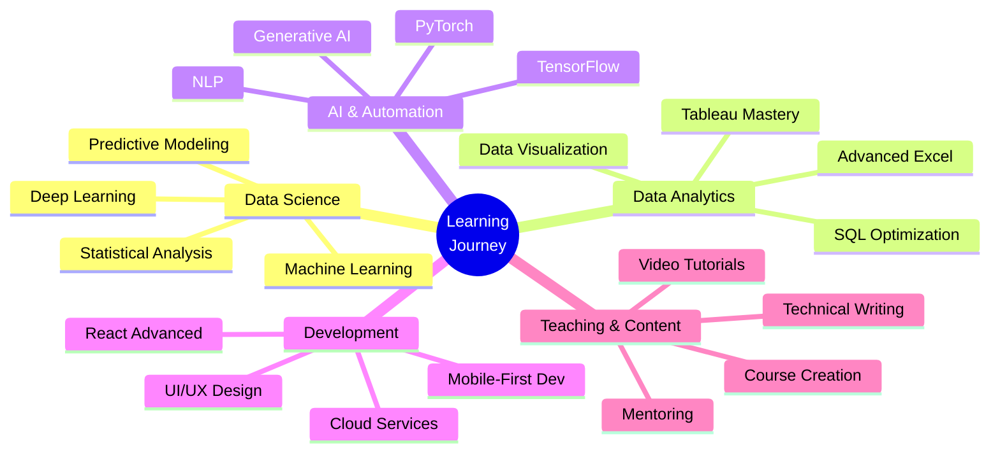

<div align="center">

# 👋 Hi, I'm Priyanshu Pandey

[](https://github.com/priyanshuarc)

[](mailto:priyanshu.edu.py@gmail.com)
[](https://linkedin.com/in/priyanshuarc)
[](https://t.me/priyanshuarc)
[](https://github.com/priyanshuarc)
[](tel:+917021884961)

</div>

---

## 🚀 About Me

```python
class PriyanshuPandey:
    def __init__(self):
        self.name = "Priyanshu Pandey"
        self.role = "Data Scientist | Analyst | Editor | Teacher | Full-Stack Developer"
        self.education = "B.Sc. IT @ Thakur College (2024-2027)"
        self.location = "Mumbai, India"
        self.languages = ["English", "Hindi"]
        self.passion = "Transforming data into actionable insights 📊"
        
    def current_focus(self):
        return [
            "📈 Data Science & Analytics",
            "🤖 AI/ML Applications",
            "🌐 Web & Mobile Development",
            "🎮 Game Development",
            "✍️ Technical Content Creation",
            "👨‍🏫 Teaching & Mentoring"
        ]
    
    def seeking(self):
        return "Google Data Analytics Apprenticeship 2026"
```

> 🎯 **Second-year B.Sc. IT student** passionate about uncovering insights through data-driven solutions. Skilled in data science, analytics, visualization, teaching, and structured problem-solving with a strong foundation in Python, SQL, and Excel.

---

## 💼 Professional Summary

<table>
<tr>
<td width="50%">

### 🎓 Education
**Thakur College of Science and Commerce**  
📍 Mumbai, India  
🎓 B.Sc. Information Technology (2024-2027)  
📚 Current: 2nd Year  

**Relevant Coursework:**
- Data Science & Statistics
- Machine Learning & AI
- Database Systems
- Programming (Python, C++, Java)

</td>
<td width="50%">

### 📊 Key Strengths
- 🔬 **Data Science** - ML, AI, Statistical Analysis
- 🔍 **Data Analysis** - SQL, Excel, Python
- 📈 **Visualization** - Power BI, Tableau
- ✍️ **Content Creation** - Technical Writing, Editing
- 👨‍🏫 **Teaching** - Mentoring, Training
- 💻 **Development** - Web, Mobile, Games
- 🧠 **Critical Thinking** - Problem-solving
- 🤝 **Collaboration** - Team & Independent
- 🎨 **Design** - UI/UX, Figma, Blender

</td>
</tr>
</table>

---

## 🛠️ Technical Skills

### 📊 Data Science & Analytics


### 💻 Programming Languages


### 🌐 Web Development


### 🎮 Game & Mobile Development


### 🗄️ Databases & Cloud


### 🎨 Design & Tools


### ⚙️ Other Tools


---

## 🔭 Featured Projects

<table>
<tr>
<td width="50%">

### 📊 [Crypto Adoption Analysis](https://github.com/priyanshuarc)


Collected, cleaned, and analyzed global cryptocurrency adoption datasets (2009–2023) using Excel, Google Sheets, and Power BI dashboards. Uncovered trends and patterns in global crypto adoption.

</td>
<td width="50%">

### 🗑️ [SmartBin Dashboard](https://github.com/priyanshuarc)


Built IoT + web dashboard to track live waste bin fill levels using Arduino sensors. Real-time monitoring for smart waste management.

</td>
</tr>
<tr>
<td width="50%">

### 🗳️ [WEB-SOLVE (JantaVaani)](https://github.com/priyanshuarc/WEB-SOLVE)


Civic issue reporting platform with live tracking, enabling citizens to report and track municipal problems in real-time.

</td>
<td width="50%">

### 🌸 [Luna Cycle - Period Tracker](https://github.com/priyanshuarc/Period-Tracker)


Health-tracking application with predictive cycle tracking, symptom logging, and personalized insights for women's health management.

</td>
</tr>
<tr>
<td width="50%">

### 👻 [Horror Escape Game](https://github.com/priyanshuarc/HorrorGame)


Mobile horror puzzle game built in Unity with immersive gameplay, 3D environments, and atmospheric sound design.

</td>
<td width="50%">

### 🤖 [AI Chat Simulator](https://github.com/priyanshuarc)


Firebase-based prototype enabling AI-driven persistent chats with natural language processing and conversation memory.

</td>
</tr>
<tr>
<td width="50%">

### 🎓 [Raah - College Utility Platform](https://github.com/priyanshuarc)


Comprehensive college utility web platform for students with features for notes sharing, schedules, and resource management.

</td>
<td width="50%">

### 📈 [Data Cleaning & Visualization](https://github.com/priyanshuarc)


Processed raw datasets into actionable insights using advanced Excel functions and created interactive Power BI dashboards.

</td>
</tr>
</table>

---

## 🏆 Achievements & Certifications

<div align="center">

| 🎖️ Achievement | 📝 Description |
|:---|:---|
| **🔬 CIIA Exhibition 2023** | Presented Arduino-based Blind Turn Safety System at CIIA Exhibition |
| **📊 Data Analytics Workshop** | Certified in Data Analytics (Power BI, Tableau) |
| **💻 GitHub Portfolio** | Built diverse projects in Python, C++, web and game development |
| **📈 Dashboard Design** | Designed analytical dashboards used for decision-making practice |
| **🌟 Leadership Recognition** | Recognized for leadership, adaptability, and independent execution |
| **📚 Technical Publications** | Published projects & technical case studies on GitHub & blogs |

</div>

---

## 🌱 Currently Exploring

<div align="center">



</div>

- 🔬 **Data Science** - Machine Learning, Deep Learning, AI Models, Statistical Modeling
- 📊 **Data Analytics** - Power BI, Tableau, Advanced Excel, Predictive Analytics
- 🤖 **Generative AI** - Large Language Models, Prompt Engineering, Automation
- ✍️ **Content Creation** - Technical Writing, Editing, Tutorial Development
- 👨‍🏫 **Teaching** - Course Design, Mentoring, Educational Content
- 🎨 **UI/UX Design** - Figma, Mobile-First Development, User Research
- ☁️ **Cloud Technologies** - Firebase, AWS, Docker, Microservices

---

## 💡 Core Competencies

<div align="center">

| 🎯 Area | 🔧 Skills |
|:---|:---|
| **🔬 Data Science** | Machine Learning • Deep Learning • Statistical Analysis • Predictive Modeling |
| **📊 Data Analysis** | SQL • MS Excel • Google Sheets • Python (Pandas, NumPy) • R |
| **📈 Visualization** | Power BI • Tableau • Matplotlib • Seaborn • Plotly |
| **🧹 Data Management** | Data Cleaning • Web Scraping • ETL Processes • Data Processing |
| **📐 Analytics Tools** | Statistics • A/B Testing • Data Mining • Hypothesis Testing |
| **✍️ Content & Teaching** | Technical Writing • Documentation • Editing • Course Creation • Mentoring |
| **💼 Productivity** | Google Workspace • MS Office • Project Management • Documentation |
| **🧠 Soft Skills** | Critical Thinking • Problem Solving • Teamwork • Communication • Leadership |

</div>

---

## 🎯 Seeking Opportunities

<div align="center">

### 🌟 Google Data Analytics Apprenticeship 2026

**Why I'm a Great Fit:**
- ✅ Strong foundation in SQL, Python, Excel, and Power BI
- ✅ Proven track record with data science and analytics projects
- ✅ Passionate about data-driven decision making
- ✅ Experience with end-to-end data analytics pipeline
- ✅ Strong communication, teaching, and presentation skills
- ✅ Technical writing and content creation expertise

**📍 Preferred Locations:** Hyderabad • Bengaluru • Mumbai • Gurgaon  
**💼 Work Mode:** Open to Hybrid Work  
**📜 Eligibility:** Eligible for Government Apprenticeship programs (no prior enrollment)

</div>

---

## 📊 GitHub Stats

<div align="center">


</div>

---

## 📫 Let's Connect!

<div align="center">

**I'm always open to interesting conversations and collaboration opportunities!**

[](mailto:priyanshu.edu.py@gmail.com)
[](mailto:ceo.priyanshupandey@gmail.com)

[](https://linkedin.com/in/priyanshuarc)
[](https://t.me/priyanshuarc)
[](tel:+917021884961)

### 🌐 Find me around the web:
💼 Professional insights on [LinkedIn](https://linkedin.com/in/priyanshuarc)  
💻 Code and projects on [GitHub](https://github.com/priyanshuarc)  
💬 Quick chats on [Telegram](https://t.me/priyanshuarc)  
📧 Email for collaborations: priyanshu.edu.py@gmail.com

</div>

---

## 📝 Personal Information

<div align="center">

| 🏷️ Detail | ℹ️ Information |
|:---|:---|
| **📅 Date of Birth** | 27 December 2007 |
| **🌍 Nationality** | Indian |
| **💳 Aadhaar** | Linked with active mobile number |
| **🗣️ Languages** | English, Hindi |
| **📍 Location** | Mumbai, Maharashtra, India |
| **🎓 Graduation Year** | 2027 |

</div>

---

<div align="center">

### ⚡ Fun Fact
*"I believe every dataset has a story to tell, and I love being the storyteller!"*

### 🎯 Life Philosophy
```javascript
while(alive) {
    eat();
    sleep();
    code();
    analyze();
    teach();
    create();
    repeat();
}
```

---

### 💖 Tools & Technologies I Love

<p align="center">
 


</p>

---


### ⭐️ *Always learning, building, teaching, and sharing!*

**"Data is the new oil, and I'm here to refine it!"** 🚀

---

<sub>💡 **Pro Tip:** Star this repo if you found it inspiring! ⭐</sub>

</div>
